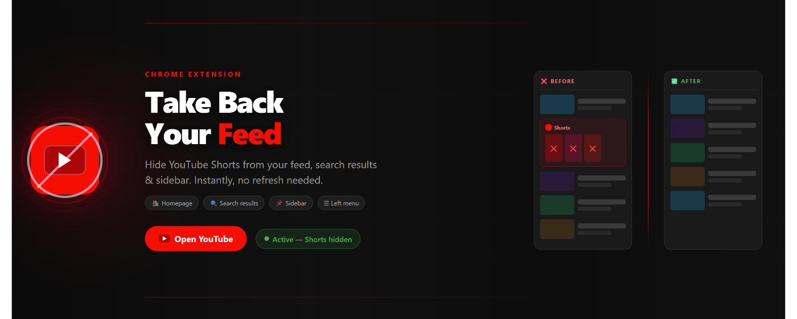
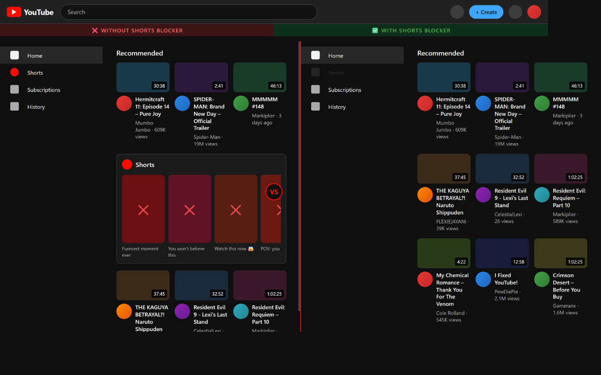
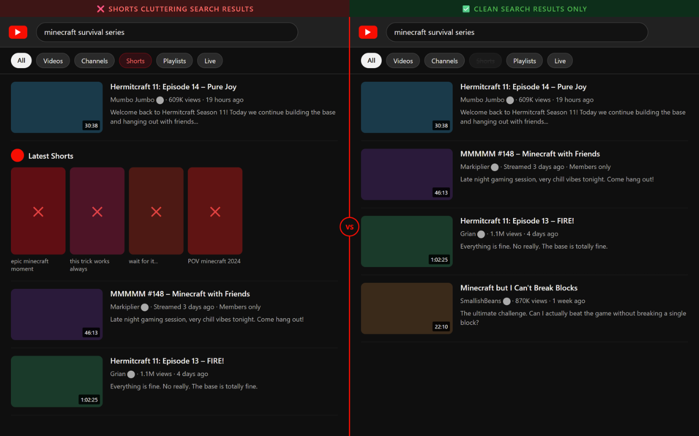
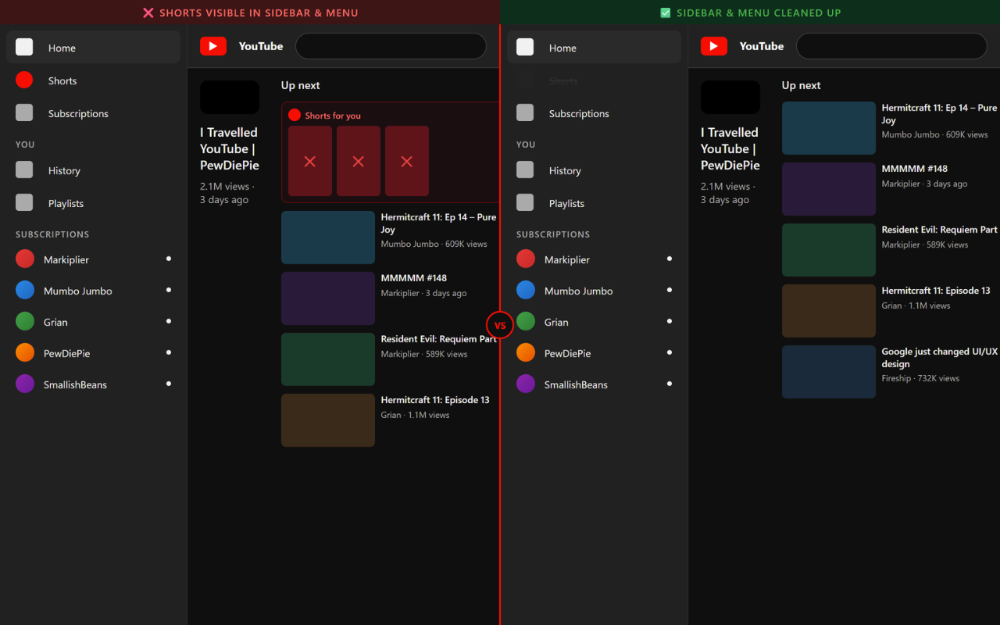
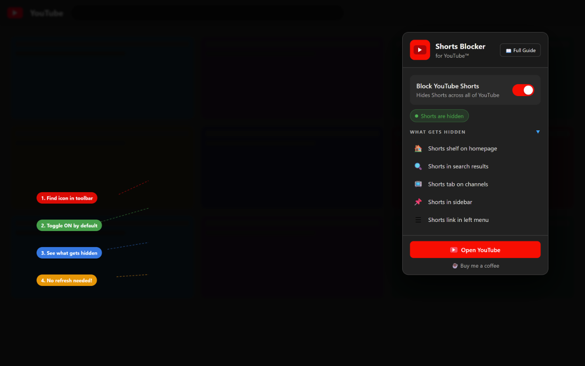

# Shorts Blocker for YouTube

A lightweight Chrome extension that instantly hides YouTube Shorts across every page — no refresh needed, no bloat.

[](https://ko-fi.com/farithadnan)
[](LICENSE)

---

## Screenshots

| Homepage | Search |
|---|---|
|  |  |

| Sidebar | Popup |
|---|---|
|  |  |

---

## Inspiration

Inspired by [PewDiePie's video](https://www.youtube.com/watch?v=5nL-Eq1lpDU) where he builds his own browser extension to remove Shorts. Same idea, built independently.

---

## What it hides

| Location | What gets removed |
|---|---|
| Home feed | The Shorts shelf between regular videos |
| Search results | Shorts strips and reel sections |
| Channel pages | The Shorts tab |
| Sidebar (right) | Shorts in the "Up Next" panel |
| Left nav (expanded) | The Shorts link and its section |
| Left nav (collapsed) | The Shorts icon in the mini sidebar |
| Search filters | The Shorts chip |

---

## How it works

Injects a single `<style>` tag into every YouTube page with CSS rules that hide all Shorts-related elements:

- **Instant** — CSS is applied by the browser's render engine before elements paint
- **Zero-lag** — no `querySelectorAll` polling loops
- **SPA-aware** — a `MutationObserver` re-applies rules when YouTube navigates without a full reload

Preference is saved in `chrome.storage.sync` and syncs across devices.

---

## Does this violate YouTube's Terms of Service?

**No.** YouTube's ToS targets scraping, access circumvention, and metric manipulation. This extension:

- Makes no requests to YouTube's servers
- Does not modify, extract, or transmit any content
- Only affects what *you* see in *your own browser*
- Is functionally identical to hiding elements via DevTools

Extensions like uBlock Origin and SponsorBlock work the same way and are used by tens of millions of people.

---

## Install (developer mode)

1. Clone or download this repo
2. Add `icon16.png`, `icon48.png`, `icon128.png` to the `icons/` folder
3. Go to `chrome://extensions`, enable **Developer mode**
4. Click **Load unpacked** and select this folder

**Icon sizes:** 16×16, 48×48, 128×128 px (PNG)

---

## Project structure

```
youtube-short-hider/
├── manifest.json
├── README.md
├── PUBLISHING.md              # Ko-fi, Chrome Web Store & CI/CD setup guide
├── src/
│   ├── background.js          # Service worker — sets default state on install
│   ├── content.js             # Injected into youtube.com — applies/removes CSS
│   ├── popup.html / .js       # Toolbar popup
│   └── welcome.html / .js     # First-run guide page
├── icons/
│   ├── icon.svg               # Source icon
│   ├── icon16.png
│   ├── icon48.png
│   └── icon128.png
├── assets/                    # Store listing & promo images
└── .github/workflows/
    └── release.yml            # Auto-publish to Chrome Web Store on push to main
```

---

## Publishing & CI/CD

See [PUBLISHING.md](PUBLISHING.md) for the full guide covering Ko-fi setup, Chrome Web Store submission, Google OAuth credentials, and GitHub Actions auto-deploy.

---

## License

MIT
